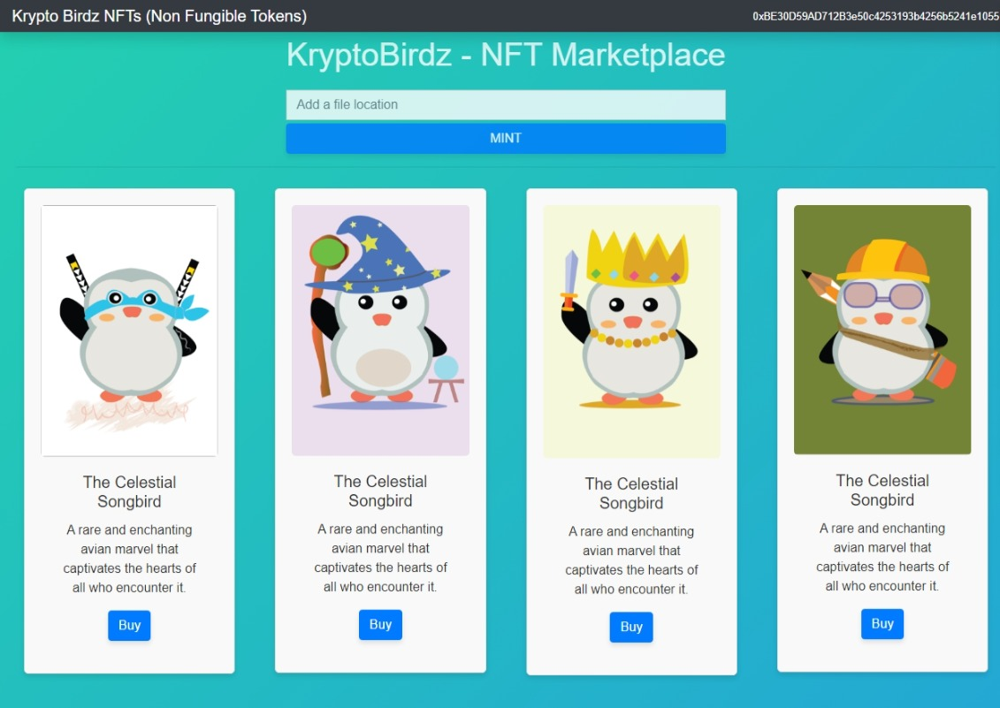

# 🦅 KryptoBirdz — NFT Marketplace (Demo Build)

> **This is the `frontend-only` branch** — a self-contained, wallet-free
> demonstration of the KryptoBirdz marketplace UI. It exists so anyone can see
> and click through the project in seconds, without MetaMask, test ETH, or a
> local blockchain.
>
> Looking for the full dApp (Solidity contracts + Truffle + web3)? See the
> [**`main` branch**](https://github.com/Damika-s-Play-Ground/KryptoBirdz-NFT-market-place/tree/main).

<p align="center">
  <a href="https://vercel.com/new/clone?repository-url=https%3A%2F%2Fgithub.com%2FDamika-s-Play-Ground%2FKryptoBirdz-NFT-market-place%2Ftree%2Ffrontend-only&project-name=kryptobirdz-demo&repository-name=kryptobirdz-demo">
    
  </a>
</p>

<!-- LIVE-DEMO -->
### 🔗 Live demo

**https://kryptobirdz-demo.vercel.app** _(update this to your deployment URL after the first deploy)_

---



## ✨ What's in this build

A polished, modern marketplace front end rendered entirely in the browser:

- **Animated hero** with a floating NFT card stack and live collection stats.
- **Marketplace grid** of 15 hand-illustrated birds with lazy-loaded artwork.
- **Rarity system** — Common → Rare → Epic → Legendary, each with its own
  accent colour and ribbon.
- **Search + filter** by name, trait, or token id, all client-side and instant.
- **Glassmorphism design** — dark theme, gradient orbs, hover motion, and a
  toast notification layer.
- **Fully responsive** and respects `prefers-reduced-motion`.

Everything runs in **demo mode**: the catalogue is bundled as static data, and
Buy / Like / Connect Wallet actions are simulated. In the full dApp these are
backed by an on-chain **ERC-721** contract accessed through **web3.js**.

## 🧱 Tech stack

| | |
|---|---|
| Framework | React 17 + Create React App 5 |
| Styling | Hand-written CSS design system (no UI framework) |
| Data | Static local catalogue (`src/data/birdz.js`) |
| Hosting | Vercel (static build) |

No `web3`, `bootstrap`, or `mdb` dependencies — the demo bundle is ~46 kB
gzipped.

## 🚀 Run locally

```bash
git clone -b frontend-only https://github.com/Damika-s-Play-Ground/KryptoBirdz-NFT-market-place.git
cd KryptoBirdz-NFT-market-place
npm install --ignore-scripts
npm start
```

Then open <http://localhost:3000>.

Production build:

```bash
npm run build      # outputs static assets to ./build
```

## ☁️ Deploy to Vercel

**One click:** use the **Deploy with Vercel** button above — it imports this
branch, and Vercel auto-detects the Create React App preset.

**Manual import:**

1. Go to <https://vercel.com/new> and import this GitHub repository.
2. Set the **Production Branch** to `frontend-only` (Project → Settings → Git).
3. Framework preset **Create React App** is detected automatically
   (build `npm run build`, output `build`). The included [`vercel.json`](./vercel.json)
   pins these settings and the SPA rewrite.
4. Deploy — then paste the resulting URL into the **Live demo** section above.

**Vercel CLI:**

```bash
npm i -g vercel
vercel            # preview deploy
vercel --prod     # production deploy
```

## 📁 Structure

```
public/            # index.html, manifest, favicon
src/
  components/
    App.js         # the whole demo UI
    App.css        # design system
  crypto-birdz/    # 15 bird artwork PNGs
  data/birdz.js    # demo catalogue + rarity/stats
  index.js
vercel.json        # Vercel build + SPA config
```

## 📄 License

See [LICENSE.md](./LICENSE.md).
